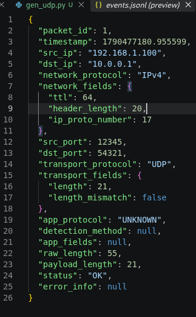

# Test Case 03: UDP Packet

## 1. Input
- Nguồn: File `input.pcap` (sinh bằng Scapy).
- Nội dung: 1 gói tin Ether/IPv4/UDP. Chứa Raw Payload dài 13 bytes (`"UDP Test Data"`).
- Port: Source 12345, Dest 54321 (Non-standard ports).

## 2. Kết quả mong đợi
- Hệ thống xử lý không crash.
- `status`: "OK".
- `network_protocol`: "IPv4".
- `transport_protocol`: "UDP".
- `payload_length`: 21 (8 bytes UDP header + 13 bytes application data).
- `app_protocol`: "UNKNOWN".

## 3. Kết quả thực tế 
Mở file `TEST/udp/events.jsonl`:

## 4. Kết luận
**PASS**